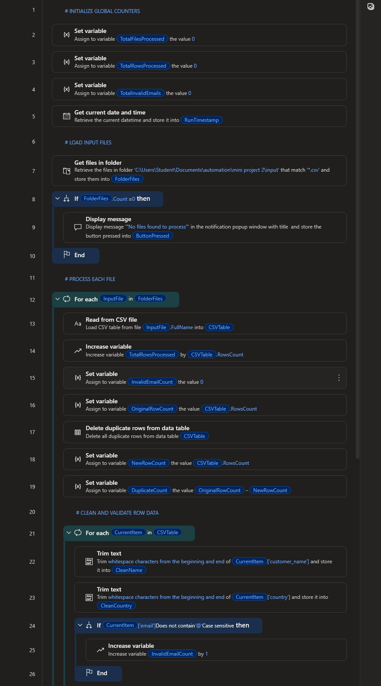
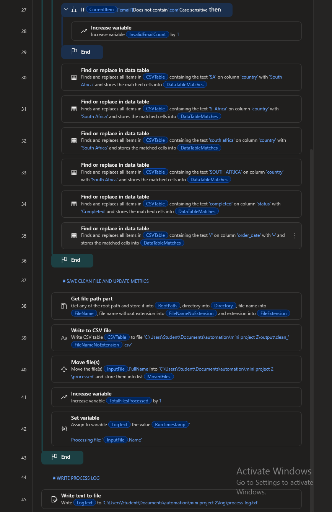

# RPA Order Processing Automation



Automated data cleaning and processing pipeline built with **Microsoft Power Automate Desktop**.

This automation scans a folder containing messy CSV order datasets, performs data cleaning and validation, removes duplicate records, and generates a clean output dataset along with processing metrics.

The project demonstrates how Robotic Process Automation (RPA) can be used to automate repetitive data preparation tasks typically performed manually by analysts or operations teams.

---

## Key Features

* Batch CSV file processing
* Duplicate row removal
* Email validation checks
* Data cleaning (whitespace trimming)
* Country value normalization
* Order status normalization
* Processing metrics logging
* Automated output dataset generation

---

## Automation Workflow

The bot follows a structured workflow:

1. Initialize processing variables and counters
2. Scan the input folder for CSV files
3. Loop through each dataset
4. Load CSV data into a data table
5. Remove duplicate rows
6. Clean text fields (trim whitespace)
7. Validate email addresses
8. Normalize inconsistent country values
9. Normalize order status values
10. Track invalid records and metrics
11. Generate a cleaned dataset
12. Write processing results to a log file

---

## Example Data Issues Handled

The provided datasets intentionally include common real-world data problems:

* Duplicate records
* Invalid email addresses
* Missing email values
* Leading/trailing whitespace in fields
* Inconsistent country naming (e.g., *South Africa*, *SA*, *south africa*)
* Inconsistent status formatting

The automation automatically detects and resolves these issues.

---

## Project Structure

```
rpa-order-processing-automation

sample-data/
    customer_orders_raw.csv
    customer_orders_raw_2.csv

output-example/
    cleaned_orders_example.csv

screenshots/
    flow_overview.png
    data_cleaning.png
    process_logging.png
```

---

## Example Automation Result

Raw datasets containing duplicates and formatting issues are processed automatically to produce a clean, structured dataset ready for analysis or reporting.

---

## Technologies Used

* Microsoft Power Automate Desktop
* CSV Data Processing
* Robotic Process Automation (RPA)

---

## Purpose of This Project

This project demonstrates practical automation design for handling messy operational data.
It highlights how RPA can streamline data preparation workflows and reduce manual processing time.

---

## Author

Data Analytics & Automation Portfolio Project
